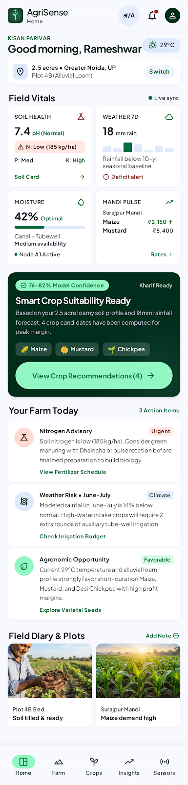
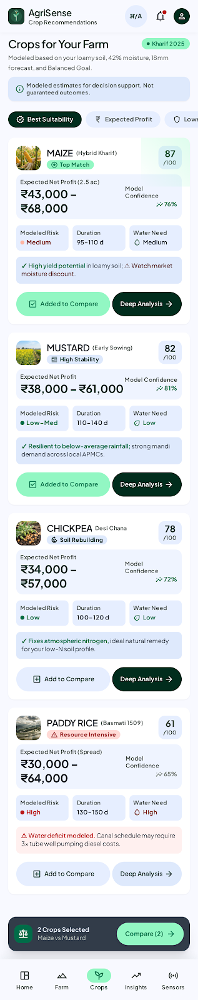
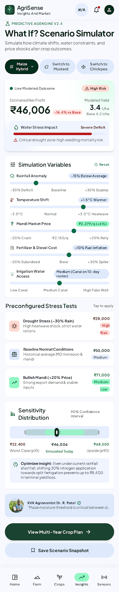

<div align="center">

# 🌱 AgriSense

### Practical farm insights, designed for the growing season.

An Android decision-support prototype that brings crop recommendations, soil and weather summaries, and farm planning tools together in one place.

<br />


</div>

---

## 🌾 What is AgriSense?

AgriSense is a **native Android app prototype** for exploring farm decisions with clear, accessible summaries. Set up a sample farm, compare crop options, and experiment with changing field and market conditions.

> **Prototype notice:** Weather, soil, market, and sensor information is local demonstration data. Calculations and recommendations are simplified examples—not live forecasts, guaranteed outcomes, or professional agronomic advice.

## ✨ Explore the app

- **Farm dashboard** — a quick view of farm conditions, weather, alerts, and planning context.
- **Farm setup** — customize location, acreage, soil, irrigation, water availability, previous crop, goal, and season.
- **Crop planning** — explore recommendations and crop details, then compare crop options side by side.
- **Soil and weather** — review illustrative soil profiles and a sample seven-day outlook.
- **What If? simulator** — adjust rainfall, temperature, market price, fertilizer costs, and water availability to see modeled yield, profit, and risk change.
- **Planning tools** — review scenarios, crop rotation ideas, market insights, sensor examples, farm history, and a farm report.

## 📱 Design previews

The images below are **static design references**, not screenshots captured from a running Android device. Open a preview folder to see its original HTML export and image.

<div align="center">
<table>
  <tr>
    <td align="center"><strong>Farm dashboard</strong><br /><a href="docs/design-references/screens/farm_dashboard/code.html"></a></td>
    <td align="center"><strong>Crop recommendations</strong><br /><a href="docs/design-references/screens/crop_recommendations/code.html"></a></td>
    <td align="center"><strong>What If? simulator</strong><br /><a href="docs/design-references/screens/what_if_simulator/code.html"></a></td>
  </tr>
</table>
</div>

More screen and brand exports are collected in [`docs/design-references/`](docs/design-references/); see the [AgriSense visual design system](docs/design-system/DESIGN.md) for design tokens and guidance.

## 🚀 Run it locally

### Requirements

- Android Studio
- JDK 17
- Android SDK Platform 34 and Android SDK Build Tools
- An Android emulator or a USB-debugging-enabled Android device to install the app

### Build and test

Clone the repository, open it in Android Studio, and allow Gradle sync to complete. You can also build and run the unit tests from a terminal at the project root:

**Windows (PowerShell):**

```powershell
.\gradlew.bat :app:testDebugUnitTest :app:assembleDebug
```

**macOS / Linux:**

```bash
./gradlew :app:testDebugUnitTest :app:assembleDebug
```

The debug APK is created at `app/build/outputs/apk/debug/app-debug.apk`. To install on a connected device, run `.\gradlew.bat :app:installDebug` on Windows or `./gradlew :app:installDebug` on macOS/Linux.

If Gradle cannot find your Android SDK, set `ANDROID_HOME` and `ANDROID_SDK_ROOT` to its location, or open the project in Android Studio and configure the SDK there. The Gradle wrapper is included; no API keys or live-service credentials are needed.

## 🧭 First-run walkthrough

1. Complete onboarding and set up the example farm.
2. Visit the dashboard, then explore soil and sample weather insights.
3. Review the maize, mustard, chickpea, and rice options; open crop details or compare crops.
4. Open **What If?** and adjust the scenario inputs to explore how the illustrative estimates respond.
5. Browse scenario outcomes, rotation planning, farm history, and the farm report.

The initial example uses a 2.5-acre loamy farm in Greater Noida with medium water availability and a Rabi planning season. Farm details can be changed locally in the app.

## 🏗️ Project layout

```text
.
├── app/
│   └── src/
│       ├── main/java/com/agrisense/app/
│       │   ├── data/demo/       # Local demonstration data
│       │   ├── domain/          # Farm models and decision calculations
│       │   ├── navigation/      # Compose navigation
│       │   └── ui/              # Screens, theme, and app state
│       └── test/                # JVM unit tests
├── docs/
│   ├── design-references/       # Original screen and brand exports
│   ├── design-system/           # Visual design documentation
│   └── PROJECT_STATUS.md        # Implemented scope and known gaps
├── gradle/                      # Gradle wrapper configuration
├── build.gradle.kts
└── settings.gradle.kts
```

## 🛠️ Built with

- Kotlin
- Jetpack Compose and Material 3
- AndroidX Navigation Compose
- ViewModel and Lifecycle
- Gradle Kotlin DSL
- JUnit 4

## 🔭 Scope and next steps

This repository contains a functional UI and local demo calculations. It does **not** connect to live weather, soil, market, GPS, cloud, authentication, Bluetooth, or ESP32 services. Recommendations, scores, costs, yields, risk, and plans are simplified examples and should not be used as guarantees.

For implementation notes, verification status, and future integration gaps, see [`docs/PROJECT_STATUS.md`](docs/PROJECT_STATUS.md).

## 📄 License

No license is currently included. Unless a license is added, reuse and redistribution are not granted by default.

---

<div align="center">
Made for clearer farm decisions 🌱
</div>
